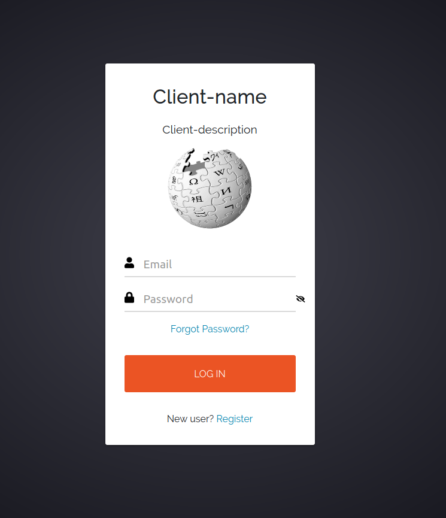
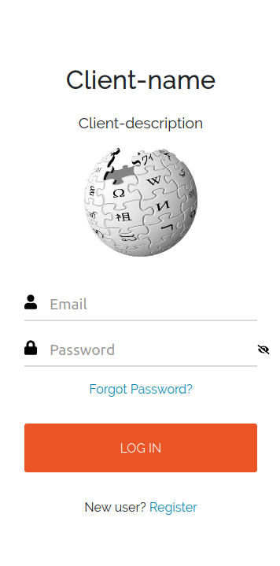

# keycloak-theme

## Screenshots
### Desktop


### Mobile


## Setup
If using keycloak with docker you can add the theme by mounting the git repo to `/opt/jboss/keycloak/themes/own-theme`

## Development
To test themes you have to disable the keycloak cache.
Mount you own `standalone-ha.xml` to `/opt/jboss/keycloak/standalone/configuration` and set following files:

```
<theme>
  <staticMaxAge>-1</staticMaxAge>
  <cacheThemes>false</cacheThemes>
  <cacheTemplates>false</cacheTemplates>#
  ...
</theme>
```

